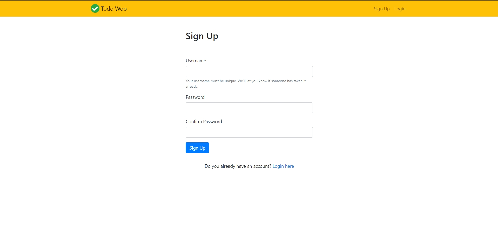

# Todo App

## ScreenShot

    
<h2>Technologies Used:</h2>
<ul>
    <li>Python</li>
    <li>Django</li>
    <li>Bootstrap</li>
    <li>JavaScript</li>
</ul>
    
<h2>Additional Python Modules Required:</h2>
<ul>
    <li>Django</li>
</ul>

<h2>Usage :</h2>

    python manage.py makemigrations

    python manage.py migrate

    python manage.py runserver
    
   In your web browser enter the address : http://localhost:8000 or http://127.0.0.1:8000/

